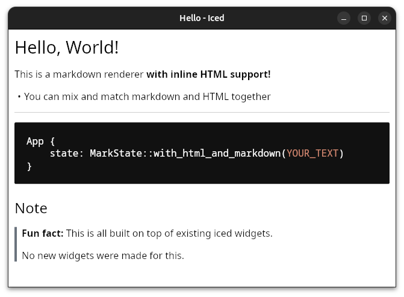
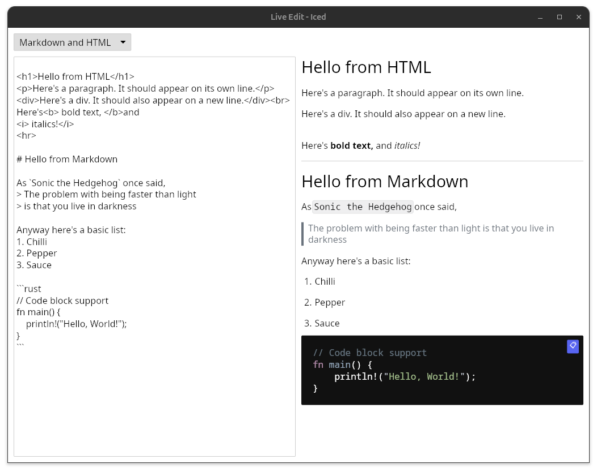
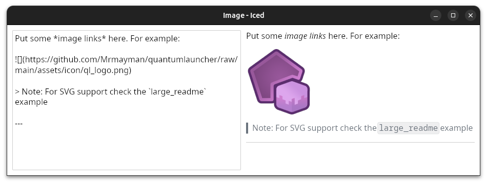
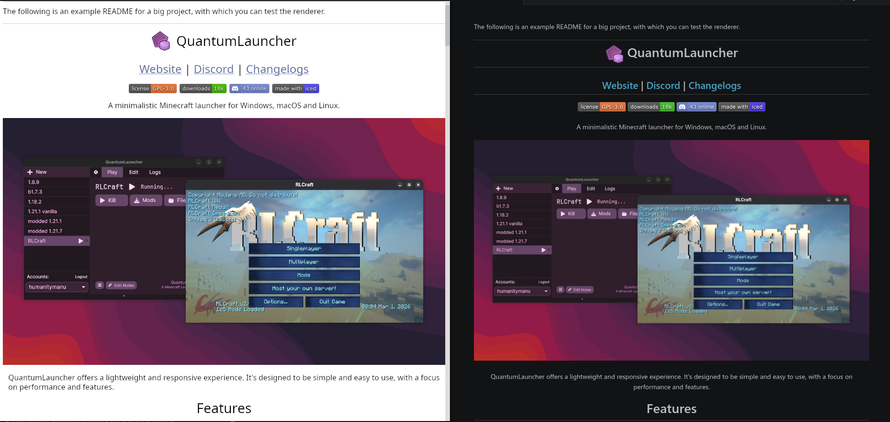

Some examples to show off functionality and act as a reference.

# Hello



```sh
cargo run --example hello
```

---

# Live Editing

Editing the document through a text editor,
with a live preview of the result.



```sh
cargo run --example live_edit
```

---

# Image

A more advanced version of **"Live Edit"**
which also showcases basic rendering of images.

> Note: This doesn't deal with SVG images,
> for that, see the **Large Readme** example.



```sh
cargo run --example image --features="iced/image"
```

---

# Large Readme

Renders two large READMEs:
- One being a custom test page that covers all available formatting features
- One being an example README of a large project ([QuantumLauncher](https://github.com/Mrmayman/quantumlauncher))

Demonstrates:
- Async image loading
- SVG rendering
- Handling link clicks

Side-by-side comparison with StriMD (left) and VSCode (right):



```sh
cargo run --example large_readme --features="iced/image iced/svg"
```

---

# Styling

An example for styling text and widgets.

```sh
cargo run --example styling
```

---

# Static Export (headless)

Parse `assets/TEST.md` through `Document` and export HTML without iced/GPU.

```sh
cargo run --example static_export --no-default-features --features no_iced,static
```

---

# Stream Chat (headless)

Simulate LLM token streaming through `StreamDocument` and stream patches.

```sh
cargo run --example stream_chat --no-default-features --features no_iced,stream
```

---

# LLM Chat (incremental Markdown)

Mini chatbot to talk to an OpenAI-compatible API and render assistant replies with **live streaming Markdown** (`MarkWidget` + `StreamDocument`).

- Settings: base URL, API key, model
- **Send** — streams from `POST {base}/chat/completions`
- **Simulate TEST.md** — offline stream of [`assets/TEST.md`](assets/TEST.md) (no API key)

```sh
cargo run --example llm_chat --features stream,iced/tokio
```

Optional: `OPENAI_API_KEY` is pre-filled from the environment. For Ollama, set base URL to `http://localhost:11434/v1` and a local model name.

---

# egui Table Harness (Task 4.5)

Visual + headless verification that GFM tables use the shared StriMD `BlockKind::Table` path (static and streamed). Replaces Nova `chat_table.rs` checks.

```sh
# CI / headless
cargo run --example egui_table_harness --no-default-features --features no_iced,static,stream -- --check

# Visual
cargo run --example egui_table_harness --no-default-features --features no_iced,static,stream
```

---

# egui Pipeline Harness (Task 7.4)

Unified static preview + streaming pipeline via StriMD only — no app-specific markdown workarounds.

```sh
cargo run --example egui_pipeline_harness --no-default-features --features no_iced,static,stream -- --check
cargo run --example egui_pipeline_harness --no-default-features --features no_iced,static,stream
```

Full harness script: `./scripts/verify-egui-harness.sh`
